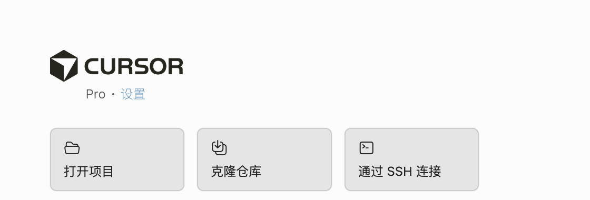
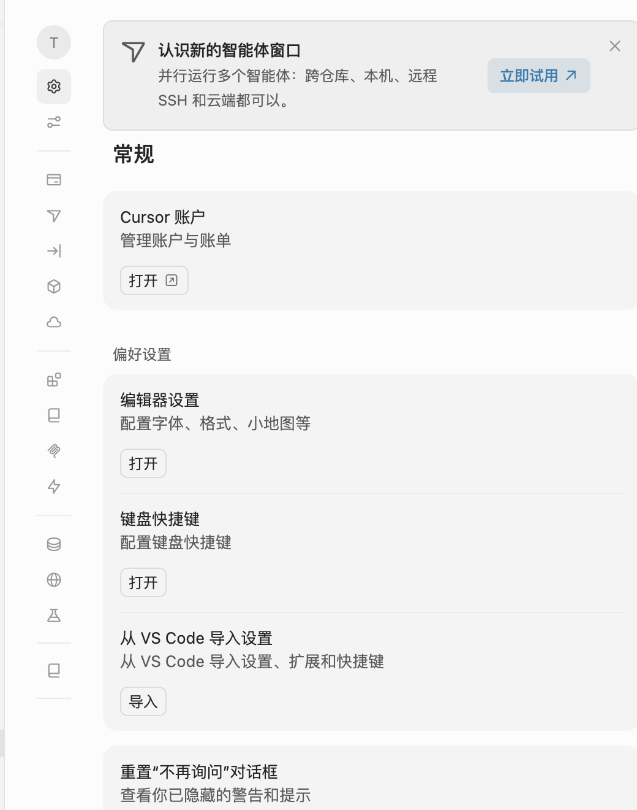
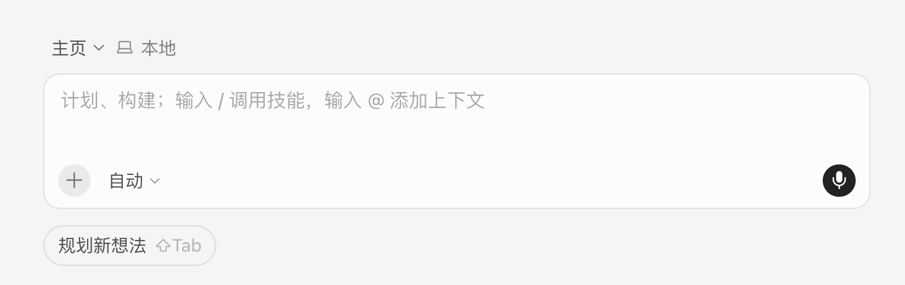
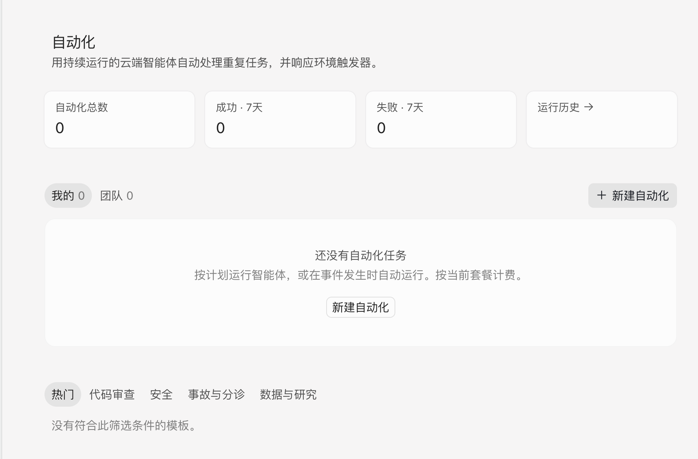
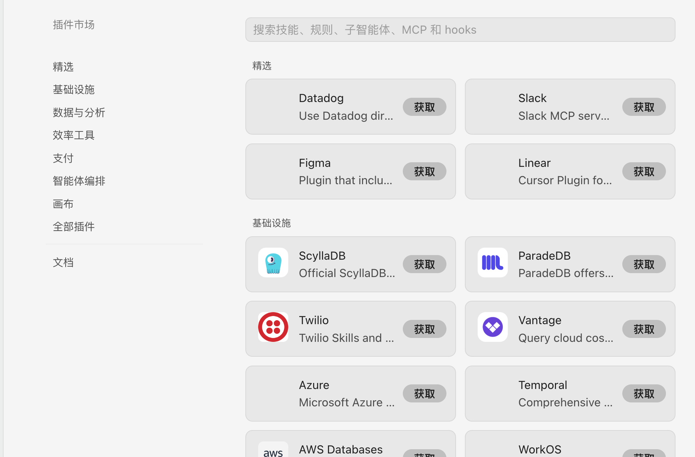
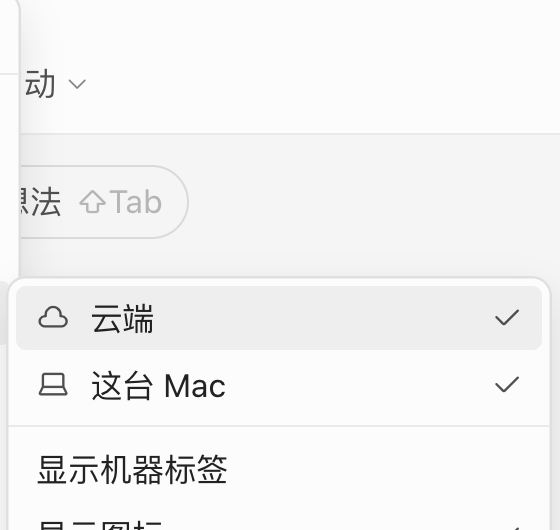

# Cursor UI Chinese Localization

[](https://github.com/wangbigtiger33-boop/cursor-ui-chinese-localization/actions/workflows/ci.yml)
[](./LICENSE)

一个非官方的 Cursor 操作界面汉化项目，目标是让中文母语用户能看懂主要按钮、菜单、设置项、筛选项和常用提示。

本项目不修改 Cursor 核心功能逻辑，只对 macOS Cursor app bundle 中的前端可见 UI 文案做精确替换。它适合中文用户自用，也适合交给其他智能体继续维护。

## 效果预览

| 欢迎页 | 设置页 |
| --- | --- |
|  |  |

| 智能体输入区 | 自动化页 |
| --- | --- |
|  |  |

| 插件市场 | 环境筛选菜单 |
| --- | --- |
|  |  |

更多截图见 [docs/screenshots](./docs/screenshots)。

## 当前适配

- 系统：macOS
- Cursor 版本：实测于 Cursor `3.6.31` 附近版本
- 主要目标文件：`/Applications/Cursor.app/Contents/Resources/app/out/vs/workbench/workbench.desktop.main.js`
- 运行环境：Node.js，无第三方依赖

## 快速使用

1. 退出 Cursor。
2. 克隆或下载本仓库。
3. 在仓库目录运行：

```bash
node ./reapply-cursor-zh-localization.js
```

只预览，不写入：

```bash
node ./reapply-cursor-zh-localization.js --dry-run
```

自定义 Cursor bundle 路径：

```bash
node ./reapply-cursor-zh-localization.js --target "/Applications/Cursor.app/Contents/Resources/app/out/vs/workbench/workbench.desktop.main.js"
```

脚本会自动：

- 备份当前 `workbench.desktop.main.js`
- 执行精确字符串替换
- 跳过命中过多的通用短语，避免误伤代码内部或远程插件描述
- 拒绝写入已知危险的全局 DOM 扫描补丁
- 运行 `node --check` 做语法检查

## 已汉化范围

主要已完成区域：

- 主侧栏：新建智能体、自动化、自定义、仓库、主页、账户菜单、设置入口。
- 设置侧栏：常规、外观、计划与用量、智能体、Tab 补全、模型、云端智能体、工作树、插件、规则/技能/子智能体、工具与 MCP、钩子、索引与文档、网络、Beta 测试、文档。
- 设置内容：账户、通知、隐私、布局、编辑器设置、键盘快捷键、导入、重置对话框、窗口布局、对话密度。
- 智能体输入区：计划/构建提示、自动模型、语音输入、规划新想法、底部提示。
- 自动化页：统计卡片、运行历史、我的/团队、新建自动化、模板分类、空状态。
- 插件页：插件、浏览插件市场、搜索或粘贴链接、全部/用户、没有插件、添加插件、推荐。
- 插件市场：插件市场、精选、基础设施、数据与分析、效率工具、支付、智能体编排、画布、全部插件、文档、获取按钮、搜索框。
- 分组/筛选菜单：状态、Git、环境、归档/未读、来源、元数据、全部标为已读。

关键二级菜单：

- 状态：草稿、运行中、需要关注、完成。
- Git：草稿、打开、已合并、已关闭、无拉取请求。
- 归档/未读：仅未读、仅归档、包含已归档、关闭。
- 来源：桌面端、网页端、移动端、源代码管理、命令行、第三方智能体、设置、SDK 开发包、API 接口、Bugbot 自动修复、前端 QA、本地。
- 元数据：工作区、分支名称、更新时间。
- 时间分组：今天、昨天、过去 7 天、过去 30 天、更早、已完成。

## 有意保留英文的内容

- 用户自己的历史对话标题，例如 `Greeting conversation`。
- 品牌名和产品名，例如 Slack、Linear、Datadog、Figma。
- 插件市场远程返回的插件名称和描述，这些内容来自网络接口，随时变化。
- 必须保留识别性的开发缩写，例如 MCP、SDK、API、Git。

## 回滚

每次运行脚本都会备份原始 bundle 到：

```text
~/.cursor/localization-backups/
```

如需回滚，把备份中的 `workbench.desktop.main.js` 复制回：

```text
/Applications/Cursor.app/Contents/Resources/app/out/vs/workbench/workbench.desktop.main.js
```

然后重启 Cursor。

## 文档

- [AGENT_BRIEF.md](./AGENT_BRIEF.md)：给其他智能体看的极简接手说明。
- [docs/VERIFY.md](./docs/VERIFY.md)：每次补丁后的实测清单。
- [docs/MAINTENANCE.md](./docs/MAINTENANCE.md)：更新 Cursor 后如何继续维护。
- [CONTRIBUTING.md](./CONTRIBUTING.md)：如何提交汉化补充和问题反馈。
- [CHANGELOG.md](./CHANGELOG.md)：版本更新记录。

## 已知风险

Cursor 更新后，app bundle 可能被覆盖，需要重新运行脚本。

修改 Cursor app bundle 可能触发完整性提示。本项目脚本默认会补丁掉已知的完整性提示逻辑。若你不希望修改这部分，可运行：

```bash
node ./reapply-cursor-zh-localization.js --skip-integrity-patch
```

曾经导致卡死的做法：全局注入 `cursor-zh-visible-text-patch`，用 MutationObserver 扫描页面所有可见文本并替换。这个方法会导致 Cursor 窗口无响应，本项目明确禁止。

## 许可证

MIT。Cursor 是 Anysphere 的产品，本项目与 Cursor/Anysphere 官方无关。
